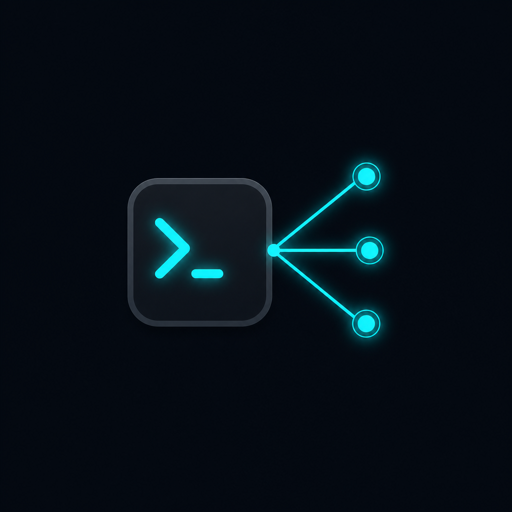

<div align="center">
  
  <h1>clustermux</h1>
  <p><strong>One terminal. Every cluster.</strong></p>
  <p>A dependency-free TUI for tmux sessions spread across SSH hosts</p>
  <p>
    <a href="https://lyttttt3333.github.io/clustermux/">Live demo</a> ·
    <a href="#install">Install</a> ·
    <a href="#usage">Usage</a>
  </p>
  
</div>

A small, dependency-free TUI for managing **tmux sessions spread across SSH hosts** — HPC login nodes, cloud dev boxes, GPU clusters — from a single terminal window.

clustermux discovers every remote tmux session in parallel, shows you what's running where, and lets you attach, create, rename, kill, or hand off sessions without juggling terminal tabs or remembering which machine hosts which session.

## Features

- **One dashboard for every host** — parallel SSH discovery of all remote tmux sessions, with reachability, latency, running command, and working directory
- **Persistent connections** — each attached session lives in a hidden local tmux window; detach and re-attach without disturbing the remote work
- **Split workspace** — a navigator sidebar plus a remote terminal pane, inside one local tmux session
- **iTerm2 integration (macOS)** — opens the manager, or any single session, in a new tab without disturbing your current one; standalone tabs auto-reconnect after transient SSH drops
- **Session management** — create empty sessions, rename, and kill remote tmux sessions from the TUI
- **Codex fork** — fork a running [Codex CLI](https://github.com/openai/codex) session into a new tmux session (finds the live rollout thread via `/proc` and runs `codex fork <thread-id>`)
- **One-command setup** — `clustermux --init` scans your SSH config, installs your key, and writes the hosts file; `clustermux --check` verifies the whole setup
- **Plain output mode** — `clustermux --list` for scripts and quick checks
- **Zero dependencies** — a single Python file using only the standard library

## Requirements

- Local: Python ≥ 3.9, tmux, and (for tab features) macOS with iTerm2
- Remote hosts: SSH access (key-based, non-interactive) and tmux
- The full-screen dashboard (`--here`) and `--list` work on any terminal; the default tab-based flow requires iTerm2

## Install

### pipx / pip

```bash
pipx install clustermux
# or
pip install clustermux
# or straight from the repo
pipx install git+https://github.com/lyttttt3333/clustermux.git
```

### Single-file script

clustermux is self-contained — download the file anywhere on your `PATH`:

```bash
curl -L -o ~/.local/bin/clustermux \
  https://raw.githubusercontent.com/lyttttt3333/clustermux/main/clustermux.py
chmod +x ~/.local/bin/clustermux
```

## First-time setup

On a fresh machine, one command walks you through everything:

```bash
clustermux --init
```

The wizard will:

1. **SSH key** — use your existing `~/.ssh` key, or offer to generate an ed25519 one
2. **Discover hosts** — scan `~/.ssh/config` (`Host` aliases, including `Include`d files) and any unhashed entries in `~/.ssh/known_hosts`
3. **Probe connectivity** — test every candidate in parallel with `BatchMode` SSH, classifying each as reachable / key-rejected / unreachable
4. **Install your key** — for hosts that reject key auth, offer to run `ssh-copy-id` (you type the password once per host)
5. **Write the config** — reachable hosts are added to `~/.config/clustermux/hosts.json` with sensible group/label defaults (existing entries are kept, and the old file is backed up); you can review the result in `$EDITOR`

Then verify the whole setup at any time:

```bash
clustermux --check
```

This checks Python, tmux, ssh, iTerm2, your SSH key and config file, then probes every configured host and reports sessions and latency per node.

## Configuration

`clustermux --init` writes this file for you, but you can also create `~/.config/clustermux/hosts.json` by hand (see [examples/hosts.json](examples/hosts.json)):

```json
[
  { "group": "GPU", "label": "login-01", "target": "me@gpu-login-01.example.com" },
  { "group": "GPU", "label": "dev-01", "target": "gpu-dev-01", "connect_timeout": 20 },
  { "group": "CPU", "label": "login", "target": "me@cpu-login.example.com" }
]
```

- `group` — shown as the cluster name in the UI
- `label` — per-host display name
- `target` — anything `ssh` accepts (host alias from `~/.ssh/config`, or `user@host`)
- `connect_timeout` — optional per-host SSH timeout in seconds (default: `--timeout`, 8s)

Hosts are validated at startup; SSH is always invoked with `BatchMode=yes`, so a host that needs a password simply shows up as offline instead of blocking the UI.

## Usage

```bash
clustermux                # open the manager workspace in a new iTerm tab
clustermux --init         # first-time setup: scan SSH config, install keys, write hosts.json
clustermux --check        # verify local requirements and probe every host
clustermux --workspace    # run the split navigator/terminal workspace here
clustermux --here         # full-screen dashboard with pane previews, in this terminal
clustermux --list         # print one snapshot as a table and exit
clustermux --refresh 60   # change the auto-refresh interval (seconds; 0 disables)
```

### Navigator keybindings (default workspace)

| Key | Action |
| --- | --- |
| `↑`/`↓` | move between clusters and sessions |
| `Enter` | attach the selected session in the right pane |
| `b` | open a remote Bash shell for the selected cluster |
| `t` | create a new empty tmux session on the selected cluster |
| `f` | fork the selected Codex session into a new tmux session |
| `e` / `x` | rename / kill the selected session |
| `o` | hand the session off to a standalone iTerm tab (auto-reconnects) |
| `r` | refresh all hosts |
| `Shift+←` | jump back to the sidebar from the remote pane |
| `q` | close the workspace (remote sessions keep running) |

Inside an attached remote tmux session, the remote prefix is `Ctrl-b` as usual; the local workspace uses `Ctrl-a`.

### Dashboard keybindings (`--here`)

`↑↓` select · `Enter` attach here · `t` new tab · `r` refresh · `p` preview · `q` quit

## How it works


- Discovery runs `tmux list-panes -a` on every host in parallel over SSH and parses a sentinel-separated format that survives older remote tmux builds.
- Attaching creates (or reuses) a hidden window in the local `clustermux` tmux session running a supervised `ssh -t host tmux attach-session ...`; the pane is swapped into the visible slot. Killing the workspace only disconnects local SSH clients — remote sessions and their processes keep running.
- The iTerm handoff moves a session into its own tab and respawns the workspace pane as a placeholder, so you can later pull it back into the workspace.

## License

[MIT](LICENSE)
